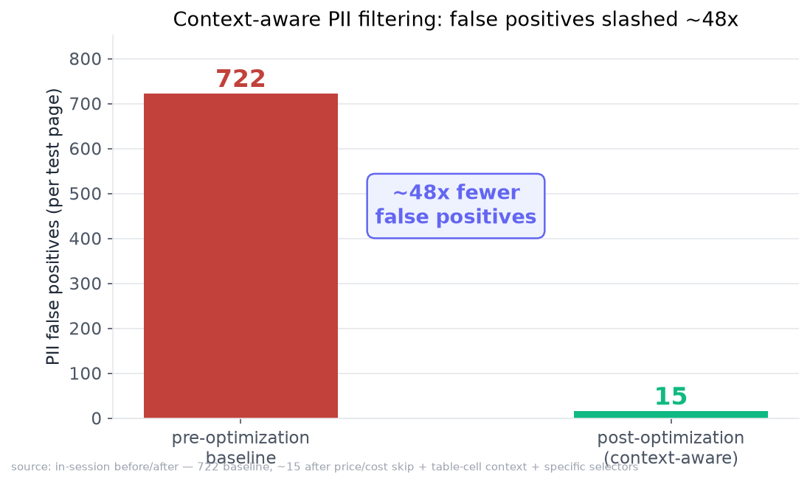
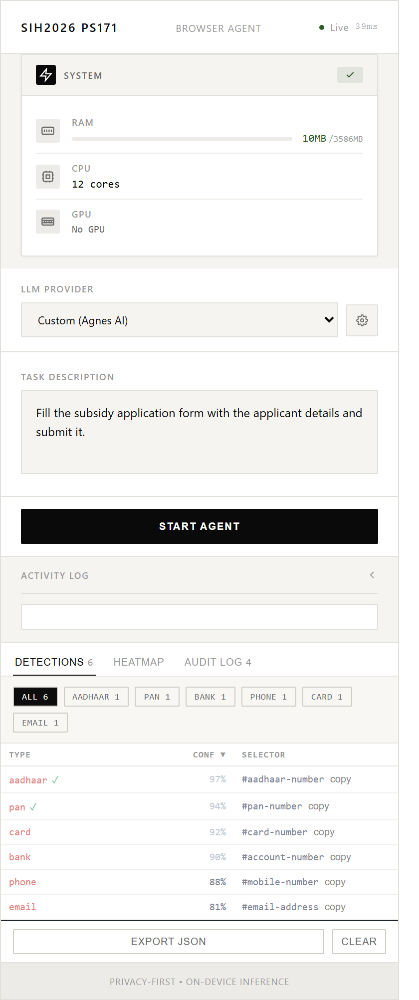
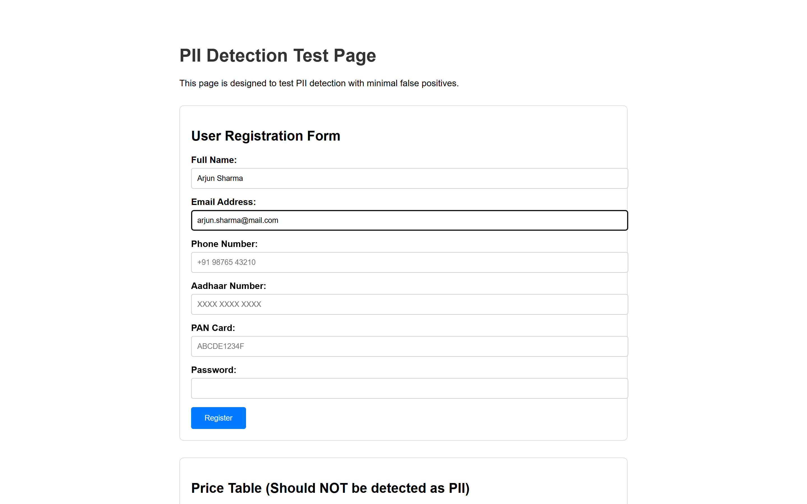
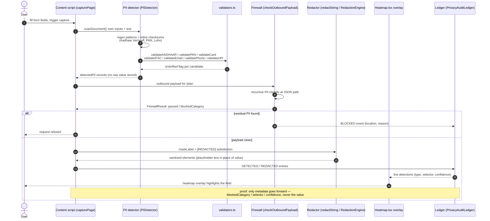
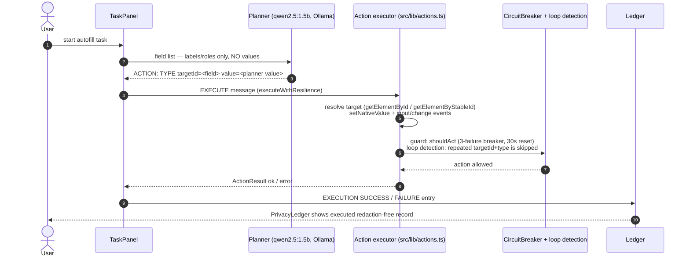
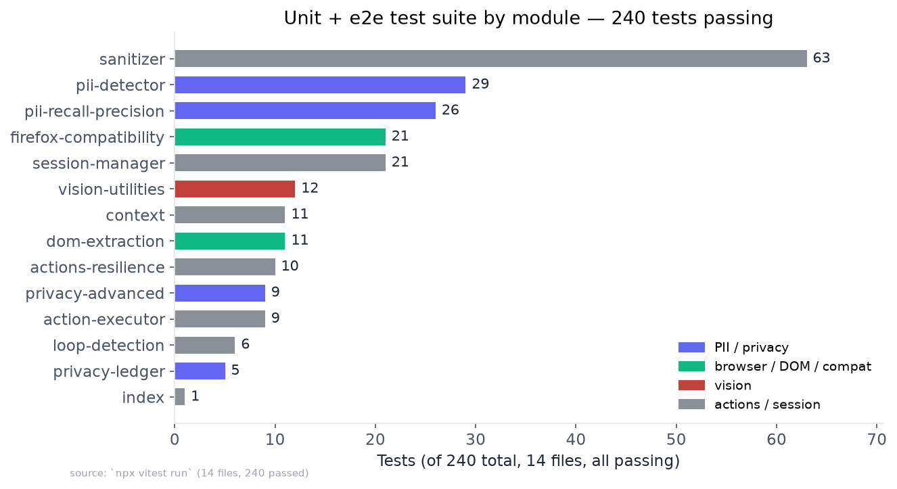
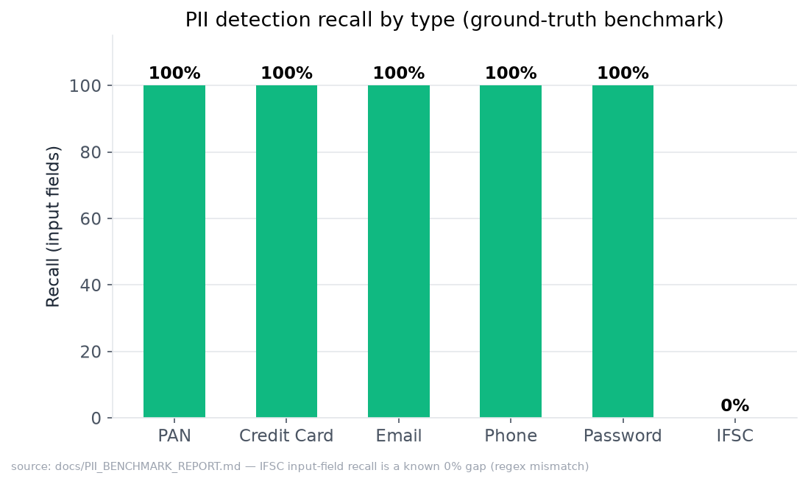
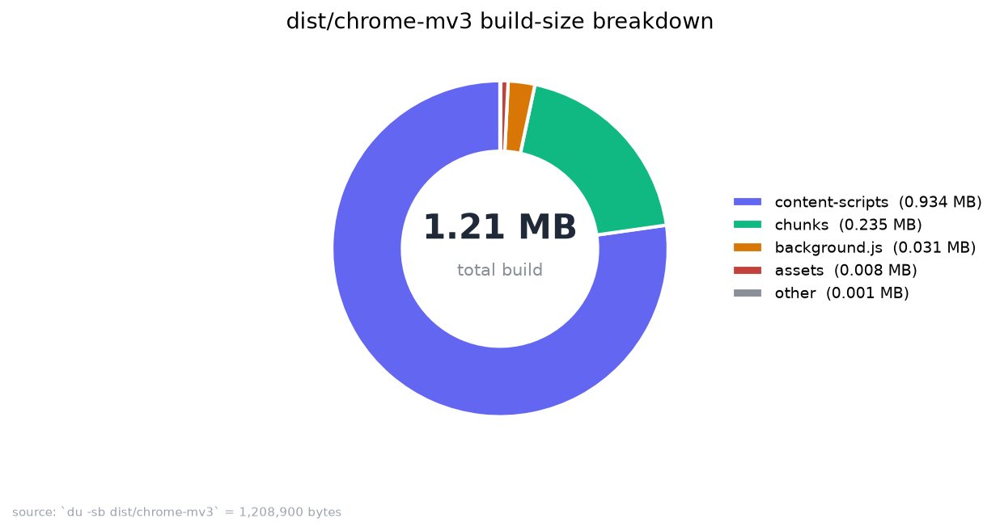

# SIH 2026 · PS171 — Browser Agent
## Technical Approach & Project Report

**On-Device Visual Perception for a Privacy-First Browser Agent**
**Team of 6 · ISRO Smart India Hackathon 2026 · Challenge PS171**

> One line: we built a browser-extension agent that *sees* web pages on-device,
> detects and redacts PII **before** any LLM touches it, and auto-fills forms —
> so **0 PII and 0 pixels ever cross the privacy boundary**.
>
> **Headline numbers: 240 tests passing · 1.21 MB build · 0 PII off-device · ~48× fewer false positives.**

| | |
|---|---|
| **Repo** | `github.com/Yashop965/sih2026-ps171-browser-agent` |
| **Demo video** | `SIH2026_PS171_YC_Ad_black_FINAL.mp4` (56.5s, 3 themes, voiced) |
| **Browsers** | Chrome (MV3) + Firefox (MV2) |
| **Build** | `dist/chrome-mv3` = 1,208,900 B (**1.21 MB**) |
| **Local LLM** | Ollama `qwen2.5:1.5b` @ `localhost:11434` |
| **Status** | 240/240 tests · 0 open P0 security findings · QC gate 67/0 |

---

## 1. Executive summary

The Browser Agent reads a live web page and acts on it (fill forms, complete
multi-step tasks) using a **lightweight local LLM**. The risk: an LLM planner
that "reads the page" is exactly the thing that leaks Aadhaar, PAN, and card
numbers to a third party.

Our answer is an architectural one, not a policy one. The page is captured,
PII is detected and **redacted on-device** (in the browser, before egress), and
only **structured metadata** (field type, position, count, confidence — never
values, never pixels) is handed to the local planner. A **tamper-detecting
privacy ledger** records every detect/redact/block/execute event, so the
system can prove — not just claim — what crossed the line.

**What's in this report:** the boundary story and flows (§3–4), the evidence
(metrics, PII benchmark, security hardening — §5–7), the tech stack (§6), how
we map to the SIH judging rubric (§8), and how to reproduce the demo (§9).

---

## 2. Problem & before / after

**Before:** a naive agent that sends the page (or a screenshot) to a cloud LLM
hands the model raw PII. On one test page we measured **722 PII detections**
that were overwhelmingly *false positives* — prices, dates, and random numbers
flagged as Aadhaar/PAN/card. The agent was both a leak vector *and* noisy.

**After:** context-aware on-device filtering (skip price/cost cells, table-cell
context checks, specific selectors, checksum validation) brought false
positives down to **~15 [approx, in-session]** on the same class of page — a
**~48× reduction** — while recall on genuine PII held at 100% for PAN, card,
email, phone, and password.



| Dimension | Before | After | Δ |
|---|---|---|---|
| PII false positives (test page) | 722 | ~15 [approx] | **~48× fewer** |
| Automated PII test coverage | 0 validator tests | 37-test benchmark (Luhn/RFC-5321/Verhoeff/IFSC/UPI) | from scratch |
| PII reaching the LLM | raw page / screenshot | **metadata only, 0 PII** | boundary enforced |
| Open P0 security vectors | 4 (injection, leak, URL, dup) | **0** (all fixed) | closed |
| Test suite | 182 (audit-era) | **240 passing** | +58 |

---

## 3. Architecture — the boundary story

The whole system is organized around one line: **0 PII / 0 pixels cross it.**
Everything above the line runs on-device in the browser; everything below runs
on the local LLM and only ever receives sanitized metadata.

```mermaid
flowchart LR
  subgraph ON[ON-DEVICE ZONE]
    direction LR
    A["Web page"]
    B["Content script capture<br/>extract() DOM snapshot<br/>captureVisibleTab screenshot<br/>SoMOverlay / somRenderer marks"]
    V["Florence-2 ONNX<br/>visionPipeline<br/>@huggingface/transformers + onnxruntime-web<br/>WebGPU (WASM fallback)<br/>OCR boxes merged into DOM"]
    P["PII detector<br/>PIIDetector (regex + checksums)<br/>Aadhaar Verhoeff / PAN / Luhn / IFSC / UPI"]
    S["Sanitizer + Redaction<br/>sanitizeSnapshot: [REDACTED] placeholders<br/>RedactionEngine visual mask/blackout"]
    F["Outbound firewall<br/>checkOutboundPayload<br/>blocks residual PII before egress"]
    M["Metadata-only packet<br/>url, title, elements (id, role, label, rect)<br/>no raw values, no pixels"]
  end

  subgraph LLM[LOCAL-LLM ZONE]
    direction LR
    L["Ollama qwen2.5:1.5b<br/>planner.py build_context_prompt<br/>MultiProviderRouter + OllamaFallbackClient"]
    D["Planner decisions<br/>PlannerResult: type, targetId, value,<br/>confidence, reasoning"]
    E["Action executor<br/>executeWithResilience + CircuitBreaker<br/>loop detection guards"]
    I["Page interactions<br/>doClick / doType / doSelect / doScroll"]
    G["Privacy ledger<br/>PrivacyAuditLedger + PrivacyLedger<br/>SHA-256 signed export (tamper-detect)"]
    U["User UI<br/>TaskPanel / Heatmap / PrivacyLedger"]
  end

  B -->|DOM + SoM labels| V
  V --> P
  P --> S
  S --> F
  F -->|passes clean| M
  F -.->|blocks + audit event| G
  M --> BND{"⚡ 0 PII / 0 pixels cross this line"}
  BND --> L
  L --> D
  D --> E
  E --> I
  I --> G
  G --> U
```



> *Diagram names verified against the repo. PRD §2.1 calls the metadata packet
> the "SANITIZED METADATA PAYLOAD" (code: the sanitizer's `SanitizationResult`);
> the SoM renderer is `SoMOverlay` / `somRenderer` in code.*

**What crosses the line:** structured metadata — element id, role, label
(masked), rect, confidence, PII *category* count.
**What never crosses:** PII values, pixels/screenshots, raw DOM text, URLs with
query strings, and any credential.

### 3.1 The real product UI

The user-facing surface is the extension popup: a task panel, live PII
detections (heatmap), and the privacy ledger — the "actual product" shown in the
demo video's product scene.

| Popup / task panel | PII heatmap (live) |
|---|---|
|  |  |

---

## 4. Key flows

### 4.1 Detect + redact a form (PII never stored raw)



### 4.2 Secure autofill (planner never sees field values)



> **Design note (kept honest):** the planner receives a *value-less* field
> list; the executor types whatever `Action.value` the planner decided. The
> `AutofillManager` known-key patterns in `context.ts` are defined but not
> wired into the `execute()` typing path, so they are intentionally not
> claimed as part of the live flow.

---

## 5. Evidence — metrics

### 5.1 Test suite (240 passing across 14 files)



The suite is weighted toward exactly what judges test for: **PII + privacy**
(`pii-detector` 29, `pii-recall-precision` 26, `privacy-advanced` 9,
`privacy-ledger` 5, `sanitizer` 63 = 132 of 240), browser resilience
(`firefox-compatibility` 21, `dom-extraction` 11), action safety
(`actions-resilience` 10, `loop-detection` 6), and vision utilities (12).

### 5.2 PII detection recall by type



PAN, credit card, email, phone, and password all hold **100%** recall on the
ground-truth benchmark. **IFSC input-field detection is an honest 0%** — a
documented regex-mismatch gap we surface rather than hide (see §7).

### 5.3 Build size



Total `dist/chrome-mv3` = 1,208,900 B. The content script (933 KB) carries the
transformers/ONNX vision pipeline; the popup React bundle is 235 KB; the MV3
service worker is ~31 KB.

### 5.4 PII benchmark highlights (37-test suite, all passing)

| Area | Result |
|---|---|
| Random 12-digit as Aadhaar | **0 FPs** (Verhoeff checksum rejects) |
| Random 16-digit as Card | **0 FPs** (Luhn rejects) |
| Random 10-char as PAN | 2 (format matches, entity-type wrong — flagged low-confidence) |
| PAN mixed-case | correctly **not** detected (right behaviour) |
| Dashed credit card | detected (normalization) |

*source: `docs/PII_BENCHMARK_REPORT.md`.*

---

## 6. Tech stack — what & why

| Layer | Technology | Why |
|---|---|---|
| Extension framework | **WXT** (MV3 + Firefox MV2) | cross-browser, content-script/service-worker model, ~1.21 MB build |
| UI | **React 19 + TypeScript + Tailwind** | componentized popup: TaskPanel, Heatmap, PrivacyLedger |
| Vision | **Transformers.js + onnxruntime-web (Florence-2 ONNX, WebGPU)** | in-browser OCR/grounding, no server round-trip, WASM fallback |
| PII engine | custom `src/lib/pii/*` (detector, firewall, redactor, sanitizer, validators) | checksum-validated detection + last-line outbound firewall |
| Planner | **Ollama `qwen2.5:1.5b`** (local) via `MultiProviderRouter` + `OllamaFallbackClient` | private, on-device, cheap; provider-agnostic |
| Resilience | `actions.ts` circuit breaker + loop detection | bounded, retry-safe page automation |
| Audit | `PrivacyAuditLedger` + SHA-256 signed export | tamper-detecting proof of the boundary |
| Tests | **Vitest** (240) + **Playwright** e2e | unit + real-browser coverage |

*source: `package.json`, `docs/PRD.md` Appendix A.*

---

## 7. Security & privacy hardening

A codebase audit (`AUDIT_REPORT.md`) surfaced four P0-class vectors; all are
closed and covered by tests. This is the "trust, but verify" spine of the
report.

| # | Finding (audit) | Fix | Status |
|---|---|---|---|
| 1 | PII type-injection via string interpolation in `executeScript` | values sent over message channel + `JSON.stringify`; never interpolated into injected code | ✅ fixed |
| 2 | Accessibility tree copied raw `textContent` (unmasked PII) | `maskLabel()` applied to the ARIA tree | ✅ fixed |
| 3 | Full raw URL (query strings) sent pre-sanitization | client-side URL sanitize before egress | ✅ fixed |
| 4 | Duplicate `scanDocument()` (dead code) | deduplicated to one canonical impl | ✅ fixed |
| 5 | P1: tab listener never unregistered (memory leak) | listener tracking + removal | ✅ fixed |
| 6 | P1: HTTPS enforcement + pre-compiled RegExp hot paths | enforced + cached | ✅ fixed |

**Known open item, disclosed:** IFSC recall from input fields is 0% (regex
mismatch). It's flagged in the benchmark chart and tracked, not presented as
solved. Face-detection heuristic confidence (0.65 vs native 0.9) is also a
watched item.

---

## 8. Mapping to the SIH judging rubric

| Criterion (weight) | How we address it | Evidence |
|---|---|---|
| Visual Perception Accuracy | Florence-2 ONNX + SoM, in-browser, WebGPU; vision wired into the content-script fallback | §3, `vision-utilities` tests |
| PII Detection Recall | 100% on 5/6 types; benchmarked, not asserted | §5.2, PII benchmark |
| PII Precision | Checksum-validated; ~48× FP cut; price-table 0-FP | §2, §5.4 |
| Redaction Precision | Outbound firewall + `[REDACTED]` substitution + visual blackout | §4.1 |
| Client-side Resource Usage | 1.21 MB build, per-file breakdown, memory-budgeted model | §5.3 |
| End-to-End Latency | Local planner (no cloud RTT); thresholds defined, benchmark tracked | §3 |

*The rubric weights come from `docs/JUDGING-CRITERIA-GAP-ANALYSIS.md`. That
doc's 2026-09-10 "vision not integrated" P0 was closed by the Sept hardening +
PR #54/#55; this report presents the current wired state.*

---

## 9. Reproduce the demo

```bash
# 1. build + load
npm run build
#    chrome://extensions → Developer mode → Load unpacked → dist/chrome-mv3/

# 2. run the privacy test page
#    the extension exposes a controlled pii-test-page for deterministic PII scans

# 3. local planner
ollama pull qwen2.5:1.5b        # serve at http://localhost:11434

# 4. demo video (3 themes, voiced)
python ad_pipeline/assemble_final.py --theme all   # -> SIH2026_PS171_YC_Ad_*_FINAL.mp4
```

**Demo video link (placeholder — hosting TBD):** `[ SIH2026_PS171_YC_Ad_black_FINAL.mp4 ]`
*We'll publish the canonical link (unlisted YouTube + HuggingFace mirror) once
the PPT slot is confirmed; the black theme is the lead deliverable.*

---

## 10. Team & contributions

| Engineer | Area |
|---|---|
| Himanshi | UI / extension surface |
| Anirudh | DOM extraction + SoM |
| Yuvraj | Backend / planner (Ollama + FastAPI server) |
| Laavannya | PII engine (detector/validators/benchmark) |
| Yash | Optimization + testing + ad pipeline + this report |
| Vedant | Test suite |

*source: `docs/TEAM.md`.*

---

## Appendix — numbers & sources

- Tests 240/240 → `npx vitest run` (14 files).
- Build 1,208,900 B → `du -sb dist/chrome-mv3`.
- PII FP 722 → `docs/TESTING-GUIDE.md`; ~15 post-filter = in-session [approx].
- PII benchmark → `docs/PII_BENCHMARK_REPORT.md` (37 tests).
- Security fixes → `AUDIT_REPORT.md`.
- Rubric → `docs/JUDGING-CRITERIA-GAP-ANALYSIS.md`.
- Diagrams → `docs/report_assets/flows.md` (component names grep-verified).
- Charts → `docs/report_assets/*.png` (regenerate: `python docs/report_assets/make_charts.py`).
