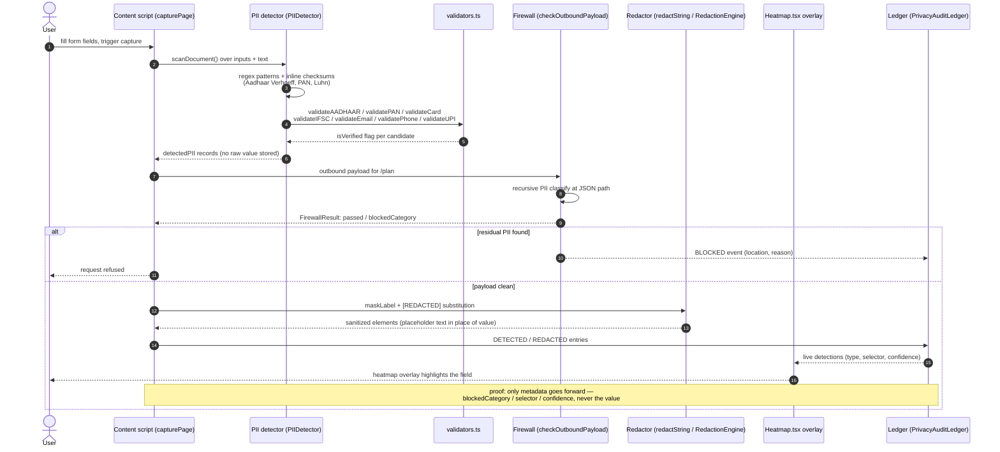
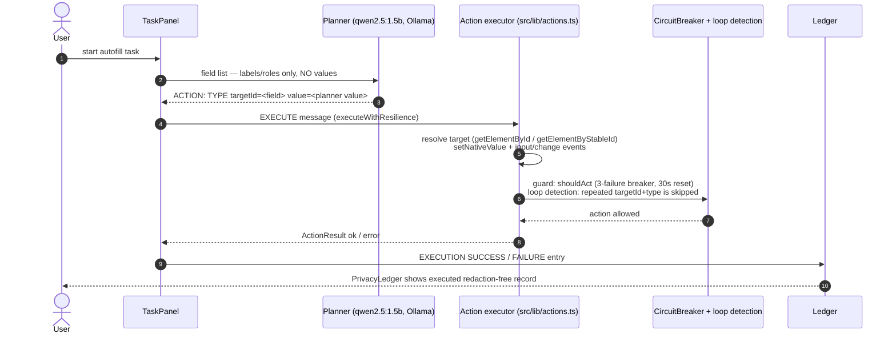

# Verified Architecture & Sequence Flows

Three diagrams, rendered natively on GitHub via fenced `mermaid` blocks.
Every node/edge name below was verified against the repo (see per-diagram
notes). Naming conflicts between `docs/PRD.md` and the code are flagged in
the one-line comment under each diagram.

## 1. End-to-end architecture (the boundary story)

```mermaid
flowchart LR
  subgraph ON[ON-DEVICE ZONE]
    direction LR
    A["Web page"]
    B["Content script capture<br/>extract() DOM snapshot<br/>captureVisibleTab screenshot<br/>SoMOverlay / somRenderer marks"]
    V["Florence-2 ONNX<br/>visionPipeline<br/>@huggingface/transformers + onnxruntime-web<br/>WebGPU (WASM fallback)<br/>OCR boxes merged into DOM"]
    P["PII detector<br/>PIIDetector (regex + checksums)<br/>Aadhaar Verhoeff / PAN / Luhn / IFSC / UPI"]
    S["Sanitizer + Redaction<br/>sanitizeSnapshot: [REDACTED] placeholders<br/>RedactionEngine visual mask/blackout"]
    F["Outbound firewall<br/>checkOutboundPayload<br/>blocks residual PII before egress"]
    M["Metadata-only packet<br/>url, title, elements (id, role, label, rect)<br/>no raw values, no pixels"]
  end

  subgraph LLM[LOCAL-LLM ZONE]
    direction LR
    L["Ollama qwen2.5:1.5b<br/>planner.py build_context_prompt<br/>MultiProviderRouter + OllamaFallbackClient"]
    D["Planner decisions<br/>PlannerResult: type, targetId, value,<br/>confidence, reasoning"]
    E["Action executor<br/>executeWithResilience + CircuitBreaker<br/>loop detection guards"]
    I["Page interactions<br/>doClick / doType / doSelect / doScroll"]
    G["Privacy ledger<br/>PrivacyAuditLedger + PrivacyLedger<br/>SHA-256 signed export (tamper-detect)"]
    U["User UI<br/>TaskPanel / Heatmap / PrivacyLedger"]
  end

  B -->|DOM + SoM labels| V
  V --> P
  P --> S
  S --> F
  F -->|passes clean| M
  F -.->|blocks + audit event| G
  M --> BND{"⚡ 0 PII / 0 pixels cross this line"}
  BND --> L
  L --> D
  D --> E
  E --> I
  I --> G
  G --> U
```

> PRD wording note: PRD §2.1 calls this the "SANITIZED METADATA PAYLOAD"
> ("Zero pixels, zero raw DOM, zero PII"); code name is the sanitizer's
> `SanitizationResult` payload. PRD §2.1 also lists "SoM Overlay Renderer" in
> the VISION PIPELINE box; code names it `SoMOverlay` (component) /
> `somRenderer` (`src/lib/vision/som.ts`).

## 2. Sequence: PII detect + redact on a form

> PRD wording note: PRD §2.1 boxes the pipeline as "PII Detector → Redactor
> → Privacy Ledger"; code splits detection across the content-script
> `PIIDetector` (inline checksums) and `src/lib/pii/detector.ts` `PIIManager`
> (shared `validators.ts`), so both are named in the diagram.

## 3. Sequence: secure autofill

> PRD wording note: "picks value source / per-field value mapping
> (first name vs last name)" is PRD-only wording — no such mapping confirmed
> in code. `src/lib/actions.ts` types whatever `Action.value` the planner
> decided; the planner receives value-less field metadata. (`AutofillManager`
> in `src/lib/context.ts` defines known-key patterns but is not wired into
> the `execute()` typing path, so it is not named here.)

---

### Node / edge counts

| Diagram | Nodes | Edges |
|---|---|---|
| 1 — architecture | 14 (12 process nodes + 2 subgraph labels, 1 boundary) | 11 |
| 2 — PII sequence | 8 participants | ~13 messages |
| 3 — autofill sequence | 5 participants | 9 messages |

### Naming conflicts (code vs PRD)

- **Vision runtime**: PRD says "onnxruntime-web / WebGPU" directly; code loads
  Florence-2 via `@huggingface/transformers` (Transformers.js) and
  `onnxruntime-web` is a separate root dependency — both present.
- **Planner**: PRD §2.1 shows a server-side FastAPI PLANNER SERVICE; code
  implements it as `server/planner.py` + `server/llm_clients`
  (`OllamaClient` / `MultiProviderRouter`). "Ollama qwen2.5:1.5b" is one
  provider, not the sole planner.
- **Ledger**: PRD/task calls it "hash-chained, tamper-detect"; code
  (`ledgerClient.buildExport`) produces a SHA-256 digest over the export
  record list (tamper-detect), not a per-entry hash chain. Diagram says
  "SHA-256 signed export (tamper-detect)" to stay faithful.
- **Detector**: two implementations exist — content-script `PIIDetector`
  (inline Verhoeff/Luhn/PAN) and `src/lib/pii/detector.ts` `PIIManager`
  (imports `validators.ts`). PRD treats it as one "PII Detector".
